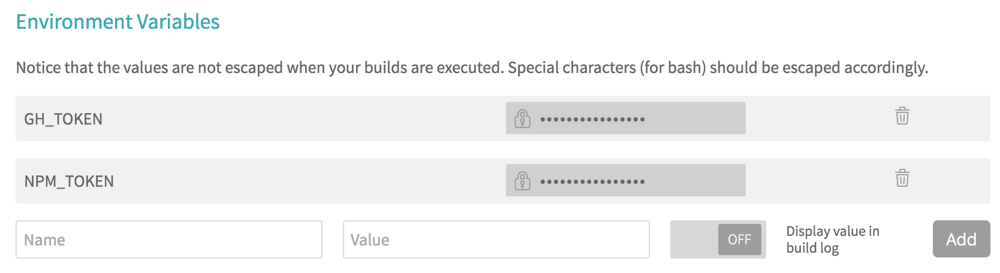

# github-semantic-version

> Automated semantic version releases powered by Github Issues.

[](https://travis-ci.org/ericclemmons/github-semantic-version)
[](http://npm.im/github-semantic-version)
[](http://npm-stat.com/charts.html?package=github-semantic-version)
[](http://opensource.org/licenses/MIT)

- - -

## Getting Started

### 1. Install

```shell
$ npm install --save-dev github-semantic-version
```

### 2. Add `GH_TOKEN` & `NPM_TOKEN` to CI

For example, in Travis CI's "Settings" tab for your project, you'll see:
> 

For your `GH_TOKEN` [create one in Github](https://github.com/settings/tokens)
with `repo` credentials.

You can find `NPM_TOKEN` in your `~/.npmrc` file:

```
//registry.npmjs.org/:_authToken=${NPM_TOKEN}
```


### 3. Create labels

```shell
$ npm install --save-dev git-labelmaker
```

```shell
$ git-labelmaker
? What is your GitHub Access Token? <paste token here>
? What is your master password, to keep your access token secure? ************
? Welcome to git-labelmaker!
What would you like to do?
> Add Labels From Package
? What is the path & name of the package you want to use? (eg: `packages/my-label-pkg.json`) ./node_modules/github-semantic-version/labels.json
Successfully created 3 labels
```

### 4. Add labels to issues

Add one of the following labels to your open PRs:

- `Version: Major`
- `Version: Minor`
- `Version: Patch`

As these get merged, `github-semantic-version` will use this to determine
how to bump the current version.

_If any un-tagged commits are pushed to `master` outside of a PR, they're
automatically treated as `patch` releases._

Once these are in place, your new versions can be pushed back to Github & NPM
without permissions & security issues.

### 5. Update `.travis.yml`

```yaml
after_success:
  npm run release
```

### 6. Update `package.json`

```json
{
  "scripts": {
    "release": "github-semantic-version",
    "postrelease": "npm publish"
  }
}
```

If you're working on an private project, you can leave out `npm publish`, which
means you have no need for your `NPM_TOKEN` either.


### License

> MIT License 2016 © Eric Clemmons
